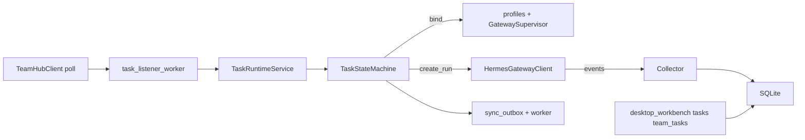

# ai-copilot-serve v1.2 功能迭代计划

## 目标与范围

- **PRD 主线**（见 [prd/ver1.2.md](d:\git_ai\ai-os-api\prd\ver1.2.md) §14 最小可交付）：本地任务与事件、Hub 轮询落库、Profile 绑定、`create_run`、run events 落 `task_events`、状态回传（outbox + worker）、基础审批、Electron 工作台聚合 API；审计满足「阻断/审批可查询」。
- **明确后置（PRD §11–12 P2）**：Skill/Tool 管理、`/api/v1/doctor`、`WebSocket` 推送等本迭代不写。
- **契约策略（已确认）**：[`integrations/team_hub/`](d:\git_ai\ai-os-api\ai-copilot-serve\src\ai_copilot_serve\integrations\) 暴露 **端口式接口**（如 `poll_assignments` / `claim` / `push_status`），默认实现为 **`StubTeamHubClient`** + pytest 可用的 **异步 HTTP Mock**（`respx` 或自定义 `MockTransport`），生产通过 `AIOS_TEAM_HUB_BASE_URL` 切换。**不在此阶段猜测真实 Hub 路径**；在 [`docs/api-contract.md`](d:\git_ai\ai-os-api\ai-copilot-serve\docs\api-contract.md) 增补「Copilot ↔ Hub 占位契约」供后续对齐。

---

## 与现有代码衔接

- **沿用**：[`HermesGatewayClient`](d:\git_ai\ai-os-api\ai-copilot-serve\src\ai_copilot_serve\integrations\hermes\client.py)、[`GatewaySupervisor`](d:\git_ai\ai-os-api\ai-copilot-serve\src\ai_copilot_serve\services\gateway_supervisor.py)、[`Profile`](d:\git_ai\ai-os-api\ai-copilot-serve\src\ai_copilot_serve\db\models\profile.py)。
- **扩展**：任务执行前检查 **Profile 已 RUNNING 且 healthy**（PRD §5.4）；否则任务留在 `LOCAL_CREATED` 或 `FAILED` 并写 `error_message`，不进入 `RUNNING`。
- **幂等**（Skill）：`remote_task_id + assignment_id + local_attempt_id`；`team_task_bindings` 唯一约束或应用层去重；`claim` 先于执行。

---

## 数据层（Alembic 迁移，按依赖顺序）

建议单条迁移链或拆为 2–3 个版本号，表与 PRD 对齐并补 **外键/索引**：

| 表 | 用途 |
|----|------|
| `local_tasks` | PRD §4.2；增加 `local_attempt_id`（Skill）、`hermes_run_id`（可空） |
| `task_events` | PRD §8.2 |
| `team_task_bindings` | PRD §3.3 |
| `approvals` | PRD §6.3 |
| `workspaces` | PRD §7.2 |
| `sync_outbox` | PRD §9.3 |
| `audit_logs` | 满足 PRD §6.6 / §7.5（最小：`action`, `actor`, `task_id`, `payload_json`, `created_at`） |

**配置**：在 [`core/config.py`](d:\git_ai\ai-os-api\ai-copilot-serve\src\ai_copilot_serve\core\config.py) 增加 PRD §3.2 环境变量；**task_routing** 用 `pydantic-settings` 嵌套结构或单独 YAML（与 PRD §5.2 一致），默认映射与表格一致；**修正 PRD 表与类型不一致**：`sales_task` 在路由表出现但 §4.3 未列——实现时二选一：增加 `sales_task` 类型或归并到 `default`，并在文档注明。

---

## 服务与状态机

- **[`services/task_state_machine.py`](d:\git_ai\ai-os-api\ai-copilot-serve\src\ai_copilot_serve\services\task_state_machine.py)**：集中合法转移（PRD §4.5「不能跳状态」）；非法转移抛业务异常并写 audit。
- **[`services/task_runtime.py`](d:\git_ai\ai-os-api\ai-copilot-serve\src\ai_copilot_serve\services\task_runtime.py)**：`create_or_update_from_assignment`、`bind_profile`（读 routing）、`request_run`（调 Hermes）、`complete`/`fail`、与 `ApprovalService` / `WorkspaceGuard` 钩子。
- **[`services/task_listener.py`](d:\git_ai\ai-os-api\ai-copilot-serve\src\ai_copilot_serve\services\task_listener.py)**：编排 poll → 去重 → `TaskRuntime`。
- **[`services/approval_service.py`](d:\git_ai\ai-os-api\ai-copilot-serve\src\ai_copilot_serve\services\approval_service.py)**：`PENDING/APPROVED/REJECTED`；`POST .../request-approval`；拒绝后任务 `FAILED` 或 `CANCELLED`（配置项二选一，默认 `FAILED` + `error_message`）。
- **[`services/workspace_guard.py`](d:\git_ai\ai-os-api\ai-copilot-serve\src\ai_copilot_serve\services\workspace_guard.py)**：`validate_path` / `validate_command`（解析 policy_json）；deny 直接失败；require_approval 创建审批或返回需审批错误码。
- **[`services/run_event_collector.py`](d:\git_ai\ai-os-api\ai-copilot-serve\src\ai_copilot_serve\services\run_event_collector.py)**：轮询或后台 task：对绑定 `hermes_run_id` 的任务调用现有 `list_run_events`，追加写入 `task_events`（去重可选：event id 或 hash）。
- **[`services/task_sync_service.py`](d:\git_ai\ai-os-api\ai-copilot-serve\src\ai_copilot_serve\services\task_sync_service.py)**：状态变更时写 `sync_outbox`；`StubTeamHubClient` 实现 `push_*` 为 no-op 成功，便于测试重试逻辑。

---

## Workers（`asyncio` + 可 cancel）

挂载于 [`core/lifecycle.py`](d:\git_ai\ai-os-api\ai-copilot-serve\src\ai_copilot_serve\core\lifecycle.py) 的 `lifespan`，与现有 `GatewaySupervisor` 并列：

- **`workers/task_listener_worker.py`**：`AIOS_TASK_POLL_INTERVAL_SECONDS`，`asyncio.Event` cancel。
- **`workers/sync_outbox_worker.py`**：退避重试，`retry_count`/错误落库。
- **`workers/run_event_worker.py`**（或合并到 runtime）：对已 `RUNNING` 且有 `hermes_run_id` 的任务拉 events。

---

## HTTP API（与 PRD 对齐，thin router）

| 模块 | 文件 | PRD 路径 |
|------|------|-----------|
| 团队拉取 | `api/v1/team_tasks.py` | `/team-tasks/pull`, `/team-tasks`, `/team-tasks/{id}`, `claim`, `sync` |
| 本地任务 | `api/v1/tasks.py` | 扩展 V1：除 PRD Sprint1 列表外，需 `run`、`cancel`、`request-approval`、`events`、`events/stream`（stream 可用 `StreamingResponse` 占位轮询 SSE） |
| 路由配置 | `api/v1/task_routing.py` 或并入 `desktop_workbench` | `GET/PATCH task-routing`, `bind-profile` |
| 审批 | `api/v1/approvals.py` | PRD §6.4 |
| Workspace | `api/v1/workspaces.py` | PRD §7.4 |
| 工作台 | `api/v1/desktop_workbench.py` | PRD §10.2 + summary JSON |

[`api/router.py`](d:\git_ai\ai-os-api\ai-copilot-serve\src\ai_copilot_serve\api\router.py) include 新 router；**工作台**可只读聚合 + 调用现有 profile status，避免重复业务逻辑。

---

## Hermes 侧小补

- PRD 与 **AGENTS.md** 均提到取消 run：在 [`integrations/hermes/client.py`](d:\git_ai\ai-os-api\ai-copilot-serve\src\ai_copilot_serve\integrations\hermes\client.py) 增加 `cancel_run`；`DELETE` 或 `POST .../cancel` 以真实 Gateway 约定为准（Mock 先实现一种）。
- **事件流**：P1 以轮询 `list_run_events` 为主；`GET .../events/stream` 可为 SSE 包装「定期 poll + yield」。

---

## 测试与文档

- **单元**：状态机转移、幂等（同 assignment 不重复建 task）、Workspace deny、审批门禁。
- **集成**：`httpx` + ASGI + `StubTeamHubClient` / Mock transport：poll → local_task → bind → mock gateway start（沿用现有 mock）→ run → events → outbox。
- **场景测试**（对应 PRD §16）：单测或长集成测拆步实现。
- 更新 [`docs/api-contract.md`](d:\git_ai\ai-os-api\ai-copilot-serve\docs\api-contract.md) v1.2 节；根 [`README.md`](d:\git_ai\ai-os-api\README.md) 可选增加「子项目 ai-copilot-serve」一句（若你希望 monorepo 可发现性）。

---

## 实施顺序（对应 PRD §13 Sprint，略调依赖）

1. **Sprint 1**：`local_tasks` + `task_events` + `TaskRuntime` + `TaskStateMachine` + `/api/v1/tasks` 基础 CRUD + 列表。
2. **Sprint 2**：`team_task_bindings` + `TeamHubClient` 抽象 + Stub + listener worker + `/api/v1/team-tasks/*`。
3. **Sprint 3**：task_routing + bind-profile + 执行链路 `create_run` + `run_id` 写回 task + collector（轮询）。
4. **Sprint 4**：`approvals` + service + gate `RUNNING` + audit 钩子。
5. **Sprint 5**：`workspaces` + `WorkspaceGuard` + validate APIs + 与 runtime 集成。
6. **Sprint 6**：`sync_outbox` + sync worker + `team-tasks/sync` 触发/补偿。
7. **收口**：`desktop/task-workbench/*` summary + pending approvals + runtime-status；端到端文档与 smoke 脚本补充。

---

## 风险与待决

- **真实 Hub 替换**：仅换 `TeamHubClient` 实现 + 契约文档，不改领域服务签名。
- **DB 初始化**：沿用 V1 `create_all` 与 Alembic 并存时，v1.2 建议在文档中写明 **迁移为唯一 DDL 来源** 或迁移与 ORM 同步策略（与 V1 review 结论一致）。
- **PRD 类型/路由表格不一致**：实施时统一到代码枚举并在 `api-contract.md` 说明。
