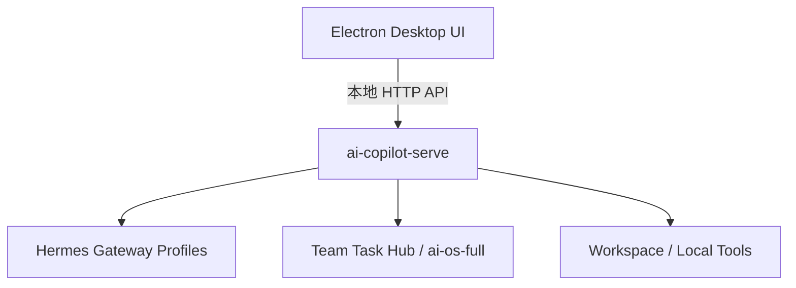
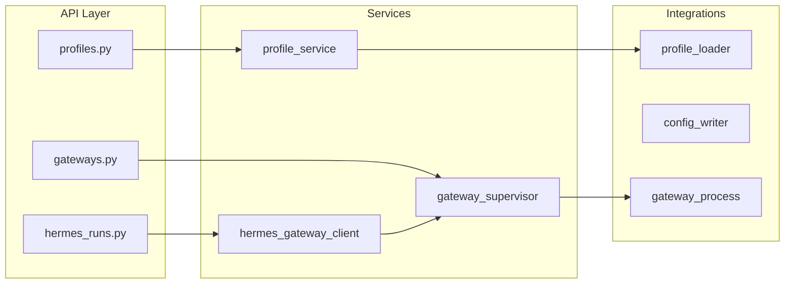

# ai-copilot-serve：功能目标与 V1.0 第一阶段计划

## 1. 项目定位与总体目标

PRD 将 **`ai-copilot-serve`** 定义为 **ai-os-desktop 的本地控制面（Local Control Plane / HermesLocalService）**，不是传统云端 Web 后端。



**一句话目标**：让桌面端通过统一本地 API 管理 Hermes Agent、多 Profile Gateway、团队任务、人工审批与 Workspace 安全边界。

### 核心职责（7 大模块）

| 模块 | 职责 |
|------|------|
| Local API | 为 Electron/React UI 提供本地 HTTP API |
| Gateway Supervisor | 多 Hermes Profile 启停、重启、健康检测 |
| Profile Runtime | profile 配置、端口、模型、环境变量、状态持久化 |
| Task Listener | 接收 ai-os-full / 同事 Agent 分派任务 |
| Approval Runtime | 代码执行、文件修改、部署等高风险动作人工审批 |
| Workspace Guard | 限制 Agent 目录、命令、写入范围 |
| Hermes Client + Audit | 统一调用 Gateway API；记录任务/审批/命令/状态 |

### 架构边界原则（桌面端）

- Renderer **不**直接管理 Hermes 进程、**不**读写 `~/.hermes`、**不**执行 shell
- 所有动作经 `ai-copilot-serve` API：`Electron Main → ai-copilot-serve → Gateway Supervisor → Hermes Gateway Process`

---

## 2. 技术栈（PRD 约定）

| 层级 | 选型 |
|------|------|
| Runtime | Python 3.12 |
| Web API | FastAPI + Uvicorn |
| DTO/Config | Pydantic v2 / pydantic-settings |
| HTTP Client | httpx（调 Hermes Gateway / Team Task Hub） |
| DB | SQLite + SQLAlchemy 2.x + Alembic |
| 进程管理 | asyncio subprocess + psutil |
| 后台任务 | APScheduler / asyncio TaskGroup |
| 流式 | sse-starlette / FastAPI StreamingResponse |
| 日志 | structlog / loguru |

团队任务第一阶段采用 **Pull Polling**（非 MQ），路径：`polling → 本地 SQLite → 用户确认/自动执行 → Hermes Profile → 状态回写 Hub`。

---

## 3. 分阶段路线图（PRD §6）

| 版本 | 目标 | 关键能力 |
|------|------|----------|
| **V1.0** | 本地服务基础版 | 单 Profile Gateway、Hermes models/runs、健康检查 |
| V1.1 | 多 Profile Supervisor | 多端口、registry、auto_start、recover、日志隔离 |
| V1.2 | Team Task Runtime | Hub client、polling、claim/sync、profile 绑定 |
| V1.3 | Approval + Workspace Guard | 白名单、command policy、审批、审计 |
| V1.4 | Windows Service | 开机自启、无窗口、服务恢复、一键部署 |

**推荐开发顺序**（PRD §7）：FastAPI 骨架 → SQLite/Alembic → Profile Runtime → Gateway Supervisor → 打通 `/v1/models` & `/v1/runs` → Electron 对接 → Team Task → Approval/Workspace → Windows Service → ai-os-full Hub。

---

## 4. V1.0 第一阶段：功能需求明细

### 4.1 交付内容

```text
- FastAPI 本地服务
- SQLite 初始化
- Profile CRUD
- 单 Profile Gateway 启停
- Gateway 健康检查
- Hermes /v1/models 读取
- Hermes /v1/runs 调用
- 基础日志查看
```

### 4.2 V1.0 范围内 API（最小集）

**System**

- `GET /api/v1/health`
- `GET /api/v1/system/info`（可选，便于 Electron 探测）

**Profile**

- `GET /api/v1/profiles`
- `POST /api/v1/profiles`
- `GET /api/v1/profiles/{profile_id}`
- `PATCH /api/v1/profiles/{profile_id}`
- `DELETE /api/v1/profiles/{profile_id}`
- `POST /api/v1/profiles/{profile_id}/start`
- `POST /api/v1/profiles/{profile_id}/stop`
- `GET /api/v1/profiles/{profile_id}/status`

**Hermes Run（经 Gateway Client 转发）**

- `GET /api/v1/profiles/{profile_id}/models`
- `POST /api/v1/profiles/{profile_id}/runs`
- `GET /api/v1/profiles/{profile_id}/runs/{run_id}`（建议纳入，便于轮询状态）
- `GET /api/v1/profiles/{profile_id}/runs/{run_id}/events`（V1.0 可先非流式或简单 SSE）

**Gateway（V1.0 简化）**

- `GET /api/v1/gateways/{gateway_id}/health`
- `GET /api/v1/gateways/{gateway_id}/logs`（基础日志查看）

**明确不在 V1.0**：多 Profile 并行（V1.1）、Team Task、Approval、Workspace Guard、Windows Service。

### 4.3 数据模型（V1.0 最小）

**`profiles` 表**（PRD §4.1）

- `id`, `name`, `type`（default/writer/coding/finance/research）
- `hermes_home`, `profile_path`, `gateway_port`
- `enabled`, `auto_start`, `status`
- `created_at`, `updated_at`

**Gateway 状态机**（V1.0 单实例即可）

```text
STOPPED → STARTING → RUNNING → ERROR → RESTARTING → RUNNING
```

### 4.4 核心服务层（V1.0 实现重点）



- **Profile Runtime**：注册、读/写 `~/.hermes/profiles/<profile>/config.yaml`、端口分配、启动参数、状态落库
- **Gateway Supervisor（V1.0 单 Profile）**：`start` / `stop` / `get_status` / `health_check` / `read_logs`
- **HermesGatewayClient**：`list_models`、`create_run`、`get_run`、`stream_run_events`（events 可二期完善）

### 4.5 推荐目录结构（PRD §3，V1.0 子集）

首期只需落地 PRD 中以下路径（其余目录可留空或 stub）：

```text
ai-copilot-serve/
├─ pyproject.toml, .env.example, alembic.ini
├─ src/ai_copilot_serve/
│  ├─ main.py, app.py
│  ├─ core/          # config, logging, errors, lifecycle
│  ├─ api/v1/        # health, profiles, gateways, hermes_runs
│  ├─ db/models/     # profile.py, gateway.py
│  ├─ schemas/       # profile, gateway, hermes
│  ├─ services/      # profile_service, gateway_supervisor, hermes_gateway_client
│  ├─ integrations/hermes/  # client, profile_loader, config_writer
│  └─ runtime/       # gateway_process, port_allocator（V1.0 单端口即可）
├─ migrations/
└─ tests/unit + integration
```

### 4.6 验收标准（PRD §6 V1.0）

| # | 验收项 | 验证方式 |
|---|--------|----------|
| 1 | Electron 能看到 profile 列表 | `GET /api/v1/profiles` 返回已注册 profile |
| 2 | 能启动 default profile | `POST .../start` 后 status 为 RUNNING |
| 3 | 能读取 Hermes models | `GET .../models` 代理 Gateway `/v1/models` 成功 |
| 4 | 能创建一次 run | `POST .../runs` 返回 run_id，可查询状态/事件 |
| 5 | Gateway 崩溃后状态可识别 | 进程退出后 health/status 变为 ERROR 或 STOPPED，非假 RUNNING |

### 4.7 V1.0 实施任务拆解（建议顺序）

1. **工程骨架**：FastAPI app、`/api/v1/health`、pydantic-settings、structlog
2. **SQLite + Alembic**：`profiles` 表迁移、async session
3. **Profile CRUD API**：注册 default profile，读写 `profile_path` / `gateway_port`
4. **Gateway Supervisor（单实例）**：subprocess 启动 Hermes Gateway、PID/端口登记、stop
5. **健康检查 Worker**：定时或 on-demand 检测进程与 HTTP health
6. **HermesGatewayClient**：httpx 调用 `http://127.0.0.1:{port}/v1/models` 与 `/v1/runs`
7. **API 暴露**：profiles 启停 + models/runs 路由
8. **日志 API**：读取 gateway stdout/stderr 或本地 log 文件 tail
9. **集成测试 + smoke script**：覆盖验收 5 条
10. **文档**：`api-contract.md` 中固化 V1.0 OpenAPI 契约，供 Electron 对接

---

## 5. V1.0 与后续版本边界

- **V1.1 才做**：多 profile 端口（8642/8643/8644…）、`gateway_registry`、`recover`、profile 互不影响
- **V1.2 才做**：`tasks` 表、Team Task Hub polling、`task_listener_worker`
- **V1.3 才做**：`approvals` 表、`workspace` policy、`validate-action` 拦截
- **V1.4 才做**：WinSW / 开机自启、无控制台窗口

避免 V1.0 引入分布式任务、审批、Workspace 策略，保持「Electron 能稳定管一个 Hermes Profile」为唯一里程碑。

---

## 6. 与当前 ai-os-api 仓库的关系（说明）

当前 [README.md](README.md) / [docs/INDEX.md](docs/INDEX.md) 描述的是 **AI OS Portal 数据层**（documents、Postgres、S3），与 PRD 中的 **ai-copilot-serve 本地控制面** 是不同产品边界。按你的选择，本计划仅作 PRD 解读，不规划与现有 `app/modules/documents` 的代码整合。

若后续要在同一 monorepo 落地，建议保持 **包级隔离**（`ai-os-api` Portal vs `ai-copilot-serve` Local），避免 SQLite 本地服务与 Postgres Portal 配置混用。
